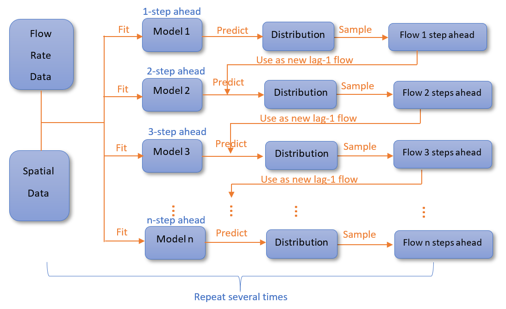

How high is the water mama?…Data Driven Flood Forecasting
================
Evelyn Moorhouse, Shangjing Hu, Jack Tan, Cheng Min  
Mentor: Vincenzo Coia

  - [Executive Summary](#executive-summary)
  - [Introduction](#introduction)
  - [Data Science Methods](#data-science-methods)
      - [Model Evaluation Metrics](#model-evaluation-metrics)
      - [Data Description](#data-description)
      - [Prediction Methodology](#prediction-methodology)
      - [Exact (Deterministic) Roll-Forward
        Probabilities](#exact-deterministic-roll-forward-probabilities)
      - [Linear Quantile Regression](#linear-quantile-regression)
      - [Linear Quantile Regression with Activation
        Threshold](#linear-quantile-regression-with-activation-threshold)
      - [Tree-Based Models](#tree-based-models)
  - [Results](#results)
  - [Future Suggestions and
    Recommendations](#future-suggestions-and-recommendations)
  - [References](#references)

# Executive Summary

This repository is the result of a capstone project between UBC MDS and
BGC, held in May and June 2020. The goal of the project is to create a
model that takes in current river discharge and hydrological spatial
data at a hydrometric gauge and outputs a probabilistic forecast of flow
6 hours into the future. Here we have demonstrated a proof of concept of
how to generate probabilistic flow 6 time steps into the future, and
evaluate a probabilistic model.

# Introduction

Many Alberta rivers have multiple pipeline crossings. Flooding along
these rivers puts pipeline infrastructure at risk of damage and failure.
Environmental and financial impacts from damaged pipelines can be
mitigated by shutting down pipelines. However, it takes 24-36 hours to
shut down a pipeline, and a single shutdown event can cost millions of
dollars (Coia 2019). Therefore, there is a need to balance the risk
associated with flood events, and the financial cost of an unnecessary
shutoff.

Flood prediction is typically based on a hydrograph which shows the flow
rate in 
over time at a gauged location in a river. Each gauge has a watershed
(Figure 1), which is defined as the area of upstream land that drains to
that gauge. There are many factors that influence the flow rate at a
gauge including precipitation, snowmelt, surface runoff, soil
saturation, and land use in the watershed of the gauge. Therefore,
adding these spatial variables can aid in predicting future flow volume
at a gauge.

Figure 1: Whatersheds and gauges

Using these variables, flood forecasting models often generate a single
point estimate for a future prediction of flow, however in doing so a
large amount of information is missed. Therefore, the goal of this
project is to generate a probabilistic prediction of flow. Probabilistic
predictions are more valuable than point estimates because they provide
probabilities for all of the most likely values of flow. As a result,
the probability of flow exceeding a given threshold can be evaluated.
Furthermore, by using a probabilistic prediction we can capture serial
dependence across multiple predicted time steps through creating
ensemble hydrographs (Figure 2).

Figure 2: Ensemble hydrograph

The project combines spatial hydrological data and flow data at 17
gauges in West-Central Alberta. Three different types of models, Linear
Quantile Regression, Random Forest, and Gradient Boosted trees, are used
to take in historical flow data and spatial data including
precipitation, snowmelt, soil moisture and surface runoff and output a
probabilistic forecast of flow for six time steps into the future.

# Data Science Methods

## Model Evaluation Metrics

To quantify the performance of different types of models, or changes
applied to one type of model (e.g. adding various NARR features in
addition to flow data), we use average quantile loss. Quantile loss at
single quantile  for a given prediction
 and outcome
 can be defined
as
![L(y\_i^{\\tau},y\_i)=\\max{\[\\tau(y\_i^{\\tau}-y\_i),(\\tau-1)(y\_i^{\\tau}-y\_i)\]}](https://latex.codecogs.com/png.latex?L%28y_i%5E%7B%5Ctau%7D%2Cy_i%29%3D%5Cmax%7B%5B%5Ctau%28y_i%5E%7B%5Ctau%7D-y_i%29%2C%28%5Ctau-1%29%28y_i%5E%7B%5Ctau%7D-y_i%29%5D%7D
"L(y_i^{\\tau},y_i)=\\max{[\\tau(y_i^{\\tau}-y_i),(\\tau-1)(y_i^{\\tau}-y_i)]}").
Therefore, to evaluate a prediction distribution, we take the average of
the quantile loss values for every quantile used to generate the
distribution. For multiple predictions, we sum the average quantile loss
across all time steps. By doing so, we assume that every prediction is
of equal importance. When comparing quantile loss values, lower average
quantile loss values indicate better performance.

To give a more intuitive evaluation on how well a model performs, we
also use a confusion matrix. However, since our model outputs a
distribution, we use the median as our best estimate. Because BGC aims
to accurately send out notifications whenever a certain river reaches
70% of its 2-year return flow, we also use this specific value as the
threshold between a true and false signal. Presenting the confusion
matrix removes the probabilistic nature of our model but it gives a
general metric of how well a method performs.

## Data Description

The two types of data used to predict future flow conditions are past
flow data and spatial data aggregated across a watershed. These two data
types are provided for 17 gauges and their corresponding watersheds
across Alberta. In the project, we work with both hourly and daily flow
data.

The North American Regional Reanalysis (NARR) dataset (Mesinger et al.
2006) is used to add spatial data to the model for each watershed. The
NARR data has four variables that are used, total precipitation (apcp:
),
snow melt (snom:
),
0-200 cm Soil moisture content (soilm:
),
and surface runoff (non-infiltrating) (ssrun:
).
Refer to the
[`NARR_data_processing.ipynb`](https://github.ubc.ca/MDS-2019-20/DSCI_591-BGC/blob/data_product/doc/NARR_data_processing.ipynb)
file to understand how the data is collected for each watershed.

## Prediction Methodology

One of the main challenges with generating a probabilistic distribution
is predicting multiple time steps into the future. To address this
challenge we generate flow predictions in two ways, a roll forward
prediction to assess model performance, and a multi-step prediction to
address the project goal.

The roll forward prediction approach uses the training data to fit the
model and generate a predicted distribution for the next time step. Then
the data of the next time step in the validation set is appended to the
training data and the model is retrained. This procedure continues
through the whole validation set (Figure 3).

Figure 3: Roll forward prediction

To produce a prediction of flow multiple time steps into the future we
use a simulation approach. Using the training data, we generate our
first prediction in the form of a probabilistic distribution. From that
distribution we randomly sample one value, and use that as the new
‘current flow’ value, to generate the prediction distribution for the
next time step. We then randomly sample from the new distribution,
repeating the processes as many time steps into the future are desired.
The whole procedure is iterated several times to generate the empirical
distributions of the flow multiple time steps into the future (Figure
4).

Figure 4: Empirical distribution from multi-step prediction

Implementing this method is different based on whether only lagged flow
values are used as predictors, or if spatial predictors are also
included. If we use only lagged flow as the predictors, we only need one
model to produce predictions for multiple time steps into the future.
However, if we want to include spatial data, we need a separate model
for every time step that we want to predict into the future. This is
because we do not want to carry forward predicted spatial data since our
model cannot predict future spatial variables. Though we fit multiple
models, we still use the simulation approach by fitting each separate
model with a randomly sampled flow value predicted from the previous
model (Figure 5). This allows us to capture the serial dependence
between flow values for each time step.

Figure 5: Multi-step prediction

## Exact (Deterministic) Roll-Forward Probabilities

For an exact and more robust predictive distribution when considering
only lagged flows, we have developed a method that computes a
deterministic probability distribution of the flow `n` steps into the
future with manageable computing costs. The method considers all
quantiles at every time step and takes averages to reduce exponential
growth of computational cost as appropriate. More details can be found
[here](https://github.ubc.ca/MDS-2019-20/DSCI_591-BGC/blob/data_product/doc/deterministic_flows.md).

## Linear Quantile Regression

Since both flow and spatial data are time series data, we initially
tried to fit an ARIMA model for baseline evaluation. However, ARIMA
models estimate the conditional mean, and as the focus of the project is
to create a probabilistic prediction, we transitioned to a Linear
Quantile Regression model. In linear quantile regression, each quantile
is fit independently to minimize quantile loss, and each quantile is a
linear function of the predictors. Unlike least squares regression,
linear quantile regression makes no distributional assumptions for the
residuals. A demonstration of linear quantile regression applied to only
lagged flow data and also lagged flow with spatial data can be found
[here](https://github.ubc.ca/MDS-2019-20/DSCI_591-BGC/blob/data_product/doc/Linear_Quantile_Reg/linear_quantile_regression.ipynb).

## Linear Quantile Regression with Activation Threshold

After fitting quantile regression on all flow data, we realized that the
model was overly tuned for “regular” days, as those comprised the
majority of the training dataset, resulting in potential floods always
being underpredicted. For example, a deluge of precipitation in May
could lead to a flood, but the same amount of precipitation in August
could lead to a negligible change in flow.

As a result, the model has decent performance when predicting regular
days, but struggles on days immediately before a flooding event. To
sensitize our coefficients to predict the latter, we want to train a
model that only looks at such data. To do this, flow values below a
certain threshold (activation threshold) are excluded from both the
train and test data. A consistent performance of recall
()
regardless of activation threshold of lag 1 flows suggests that it is
the dominant predictor of the model, and we are unable to isolate
relationships between flood events and spatial data (Figure 6).

Figure 6: Activation threshold of lag 1

The over-reliance on lag-1 flow values for prediction has also led our
model to have false confidence when rolling forward on days before an
actual flooding event. An example of this can be seen
[here](https://github.ubc.ca/MDS-2019-20/DSCI_591-BGC/blob/data_product/doc/deterministic_flows_flooding.md).

By imposing an activation threshold on the lag 3 flow, we see a sharp
decrease in performance/recall (Figure 7). This is possibly due to lag 1
and lag 3 flows being correlated, with the latter having a less
distinctive signal. More details can be found
[here](https://github.ubc.ca/MDS-2019-20/DSCI_591-BGC/blob/data_product/doc/activation_threshold_daily.md).

Figure 7: Activation threshold of lag 3

To solve this problem of over-dependence on lag-1 flow values, we come
up with two solutions. One being to engineer better features, and the
second being to assume more complex relationships between features (not
only additive, linear relationships). Below, we explore the latter with
tree-based models.

## Tree-Based Models

In order to capture the non-linear relationship between the response and
predictors, tree-based models to predict quantiles are applied.

### Random Forest

A random forest is a collection of decision trees, and a decision tree
is a model that is designed to split and group data based on some
predefined criteria. A maximum depth decision tree occurs when every
final node in the tree contains only one value, which means all discrete
groups or values have been separated. Building a decision tree to
maximum depth usually results in overfitting and high variance.
Therefore, a random forest model typically combines decision trees built
to some predefined depth, and uses them to generate a point estimate.
However, a random forest can also be used to generate a probabilistic
distribution by combining decision trees that are built to maximum depth
(Meinshausen 2006; Ghenis 2018). By building a tree to a maximum depth,
the output of each tree will be a single value, then the value from each
tree can be captured to produce a distribution, instead of averaging the
values, which is the common practice (Figure 8). This is the method
applied to the random forest model explored
[here](https://github.ubc.ca/MDS-2019-20/DSCI_591-BGC/blob/data_product/doc/Random_Forest/RF_model.ipynb).

Figure 8: Random Forest

### Gradient Boosting

Gradient boosting decision trees is similar to random forest as it
combines decision trees, however it does so in a different way. In a
random forest each decision tree is built independently and at the same
time, therefore all the results are combined at the end of the model
fit. In contrast, gradient boosting is an additive model that has the
goal of minimizing a loss function. As a result, new decision trees are
added sequentially as weak learners to minimize the loss function.
Gradient boosting can be used for quantile regression because it has a
built-in quantile loss function in Python `Scikit Learn` package
(Pedregosa et al. 2011). [Our
results](https://github.ubc.ca/MDS-2019-20/DSCI_591-BGC/blob/data_product/doc/Gradient_Boosted_Trees/gradient-boosted-trees_model.ipynb)
indicate that gradient boosted trees has similar performance to the
random forest model, but running the gradient boosted trees model is
more computationally expensive. With increased computation power,
gradient boosting has the potential to outperform random forest for a
complex model with many predictors.

# Results

Both one-step and multi-step prediction methods are applied for all the
models except gradient boosted trees. The linear quantile regression
model uses hourly data and the results can be found
[here](https://github.ubc.ca/MDS-2019-20/DSCI_591-BGC/blob/data_product/doc/Linear_Quantile_Reg/linear_quantile_regression.ipynb).
Due to limited computational power, only daily data is used for
tree-based models. More specifically, only one-step prediction is
performed on the gradient boosted trees. The results of random forest
and gradient boosted trees can be found in
[here](https://github.ubc.ca/MDS-2019-20/DSCI_591-BGC/blob/data_product/doc/Random_Forest/RF_model.ipynb)
and
[here](https://github.ubc.ca/MDS-2019-20/DSCI_591-BGC/blob/data_product/doc/Gradient_Boosted_Trees/gradient-boosted-trees_model.ipynb)
respectively.

In general, despite the high computational cost, the tree-based models
provide predictions with lower quantile loss because of their ability to
capture non-linear relationships between the response and predictors.

# Future Suggestions and Recommendations

The goal of the project is to produce a model that creates a
probabilistic prediction of flow 6 hours into the future. Our data
product satisfies this goal by presenting three model functions, linear
quantile regression, random forest, and gradient boosted trees, all of
which produce output of predicted flow 6 hours into the future. In the
model functions we allow the number of lags for flow and spatial data to
be tuned, and the type of NARR features used to be specified. Our
results show that regardless of the addition of different types of
spatial data, the dominant predictor is the previous flow. This means
that we are unable to extract a significant signal from the spatial
data. Therefore, the focus of future development should be in extracting
signal from the spatial data across a watershed. A discussion regarding
the progress made feature engineering spatial data and recommendations
for further development can be found
[here](https://github.ubc.ca/MDS-2019-20/DSCI_591-BGC/blob/data_product/doc/NARR_data_processing.ipynb).

# References

Coia, V. 2019. “Options for Data-Driven Flood Forecasting at BGC
Engineering.” *Prepared for BGC Engineering*.

Ghenis, Max. 2018. “Quantile Regression, from Linear Models to Trees to
Deep Learning.” *Towards Data Science*.
<https://towardsdatascience.com/quantile-regression-from-linear-models-to-trees-to-deep-learning-af3738b527c3>.

Meinshausen, Nicolai. 2006. “Quantile Regression Forests.” *Journal of
Machine Learning Research* 7 (Jun): 983–99.

Mesinger, Fedor, Geoff DiMego, Eugenia Kalnay, Kenneth Mitchell, Perry C
Shafran, Wesley Ebisuzaki, Dušan Jović, et al. 2006. “North American
Regional Reanalysis.” *Bulletin of the American Meteorological Society*
87 (3): 343–60.

Pedregosa, F., G. Varoquaux, A. Gramfort, V. Michel, B. Thirion, O.
Grisel, M. Blondel, et al. 2011. “Scikit-Learn: Machine Learning in
Python.” *Journal of Machine Learning Research* 12: 2825–30.

