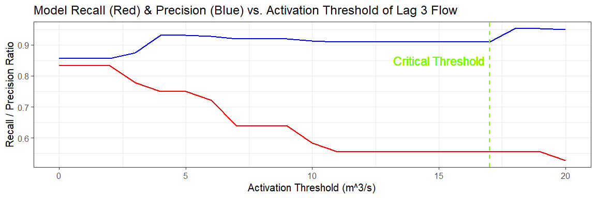

  - [Loading and Splitting Data](#loading-and-splitting-data)
  - [Selecting Desired Features](#selecting-desired-features)
  - [Training the Model](#training-the-model)
  - [Seeing how well model performs with test
    data](#seeing-how-well-model-performs-with-test-data)
  - [Imposing Activation Threshold](#imposing-activation-threshold)

### Loading and Splitting Data

``` r
# User Specificed Data
gauge <- '05DC011'
train_test_ratio <- 0.75


# Reading flow and NARR data
river_flow <- read_csv("../data/station_flowrate_R.csv",
                       col_types = cols(.default = "d", time = "D")) %>% 
  select(time, paste(gauge, '_flow_m3s-1', sep = '')) %>% 
  rename('date' = time, 'flow' = paste(gauge, '_flow_m3s-1', sep = '')) %>% 
  mutate(Year = year(date), Day = yday(date)) %>% 
  select(Year, Day, flow)

narr_data <- read_csv(paste('../data/NARR_csvs/', gauge, '_daily.csv', sep = ''),
                      col_types = cols(.default = "d", time = "D")) %>% 
  rename('date' = time) %>% 
  mutate(Year = year(date), Day = yday(date)) %>%
  select(Year, Day, apcp, ssrun, snom, soilm)


combined_data <- merge(narr_data, river_flow, by = c("Year", "Day")) %>% 
  drop_na()


# Splitting data into train and test sets
train_data <- combined_data[1:ceiling(length(combined_data$flow)*train_test_ratio), ]
test_data <- combined_data[-(1:ceiling(length(combined_data$flow)*train_test_ratio)), ]
```

### Selecting Desired Features

Since we are using the derivative and lags of certain features, and our
data is not continuous between years (we jump from the fall of last year
to the spring of the next), we have to remove a few rows at the
beginning of every year. All hydrological data such as “apcp”, “snom”
…etc are also lagged accordingly.

``` r
train_features <- data.frame()
my_years <- unique(train_data$Year)
my_lag <- 1
max_soilm <- max(train_data$soilm)

for (n in my_years){
  temp_data <- train_data %>% 
    filter(Year == n)
  
  temp_data <- temp_data %>% 
    mutate(soilm = lag(soilm, n = my_lag),
           flow1 = lag(flow, n = 1),
           flow2 = lag(flow, n = 2),
           flow3 = lag(flow, n = 3),
           apcp = lag(apcp, n = my_lag),
           ssrun = lag(ssrun, n = my_lag),
           snom = lag(snom, n = my_lag)) %>% 
    drop_na() %>% 
    select(Day, apcp, ssrun, snom, soilm, flow1, flow2, flow3, flow)
  
  train_features <- rbind(train_features, temp_data)
}


head(train_features)
```

    ##   Day     apcp     ssrun      snom    soilm flow1 flow2 flow3  flow
    ## 4 124 1.430072 1.1905868 1.2813936 4227.206 1.010 1.350 1.350 0.841
    ## 5 125 4.233666 2.4509692 1.7614946 4229.932 0.841 1.010 1.350 0.754
    ## 6 126 2.139484 1.7752857 1.2290740 4236.650 0.754 0.841 1.010 0.692
    ## 7 127 4.652978 2.7355506 4.0895920 4241.858 0.692 0.754 0.841 0.634
    ## 8 128 2.881124 1.3136247 0.9721880 4251.723 0.634 0.692 0.754 0.589
    ## 9 129 1.467491 0.9563231 0.5648416 4254.461 0.589 0.634 0.692 0.627

### Training the Model

I decided to use a linear additive model. I printed the coefficients of
the 50th percentile model.

``` r
ptm <- proc.time()

my_qr <- rq(flow ~ flow1 + flow2 + flow3 + apcp + ssrun + snom + soilm, tau = 1:99/100, data = train_features)

print(proc.time() - ptm)
```

    ##    user  system elapsed 
    ##    2.59    0.08    2.79

``` r
my_qr$coefficients[, 50]
```

    ##   (Intercept)         flow1         flow2         flow3          apcp 
    ## -4.644622e-03  1.360414e+00 -4.798223e-01  6.848565e-02  6.338318e-03 
    ##         ssrun          snom         soilm 
    ##  1.007081e-02 -5.749783e-03  1.494358e-05

### Seeing how well model performs with test data

First modify the features like we did with the training data.

``` r
test_features <- data.frame()
my_years <- unique(test_data$Year)

for (n in my_years){
  temp_data <- test_data %>% 
    filter(Year == n)
  
  temp_data <- temp_data %>% 
    mutate(soilm = lag(soilm, n = my_lag),
           flow1 = lag(flow, n = 1),
           flow2 = lag(flow, n = 2),
           flow3 = lag(flow, n = 3),
           apcp = lag(apcp, n = my_lag),
           ssrun = lag(ssrun, n = my_lag),
           snom = lag(snom, n = my_lag)) %>% 
    drop_na() %>% 
    select(Year, Day, apcp, ssrun, snom, soilm, flow1, flow2, flow3, flow)
  
  test_features <- rbind(test_features, temp_data)
}
```

Now, we iteratively predict based off our model. The critical threshold
value used is 70% of the 2-year return flow of our specificed gauge.
This value was provided by BGC. Quantile error refers to the difference
between the 50th quantile (idealisitic) and the quantile that the actual
flow landed on.

``` r
test_results <- data.frame()
my_thresh <- 17

# Iterating through every one of the test dates
for (n in 1:nrow(test_features)){
  
  # These are the input data for testing the next day
  my_test <- data.frame('flow1' = test_features$flow1[n],
                        'flow2' = test_features$flow2[n],
                        'flow3' = test_features$flow3[n],
                        'apcp' = test_features$apcp[n],
                        'ssrun' = test_features$ssrun[n],
                        'snom' = test_features$snom[n],
                        'soilm' = test_features$soilm[n])

  my_predict <- predict(my_qr, newdata = my_test)
  # Actual flow the next day
  actual <- test_features$flow[n]
  
  # Seeing which percentile we land on
  if (my_predict[99] < actual) {
    my_percentile = 1
  } else {
    for (m in 1:99) {
      if (my_predict[m] >= actual) {
        my_percentile = m*0.01
        break
      }
    }
  }

  
  # Percentage chance of exceeding desired threshold
  if (my_predict[99] < my_thresh) {
    prob_danger = 0.01
  } else {
      for (m in 1:99) {
        if (my_predict[m] >= my_thresh) {
          prob_danger = (100 - m + 1)*0.01
          break
        }
      }
  }
  
  
  # Updating storage matrix
  my_temp <- data.frame('Year' = test_features$Year[n],
                        'Day' = test_features$Day[n],
                        'Actual' = test_features$flow[n],
                        'Predict' = my_predict[50],
                        'Quantile_Error' = abs(0.5 - my_percentile),
                        'Chance_Exceeding_Threshold' = prob_danger)
  
  
  test_results <- rbind(test_results, my_temp)
}

head(test_results)
```

    ##   Year Day Actual   Predict Quantile_Error Chance_Exceeding_Threshold
    ## 1 2008 288  0.900 0.9189965           0.28                       0.01
    ## 2 2008 289  0.885 0.9221787           0.35                       0.01
    ## 3 2008 290  0.853 0.8860412           0.41                       0.01
    ## 4 2008 291  0.837 0.8492362           0.36                       0.01
    ## 5 2008 292  0.825 0.8518764           0.40                       0.01
    ## 6 2008 293  0.812 0.8312970           0.38                       0.01

Creating a confusion to represent the above data.

``` r
true_pos <- 0
true_neg <- 0
false_pos <- 0
false_neg <- 0

for (n in 1:nrow(test_results)){
  if (test_results$Actual[n] >= 17){
    if (test_results$Predict[n] >= 17){
      true_pos <- true_pos + 1
    } else {
      false_neg <- false_neg + 1
    }
  } else {
    if (test_results$Predict[n] >= 17){
      false_pos <- false_pos + 1
    } else {
      true_neg <- true_neg + 1
    }
  }
}

data.frame(row.names = c('Actual Over Threshold', 'Actual Under Threshold'),
           'Predict Over Threshold' = c(true_pos, false_pos),
           'Predict Under Threshold' = c(false_neg, true_neg))
```

    ##                        Predict.Over.Threshold Predict.Under.Threshold
    ## Actual Over Threshold                      30                       6
    ## Actual Under Threshold                      5                    1792

### Imposing Activation Threshold

Here, we impose a threshold for lag 1 flow values. Such that, if the lag
1 flow for a given test data is below our activation threshold value,
then we would assume that there’s 0 percent chance of a flood occuring.

``` r
activation_thresh <- 0:20
confusion_df <- data.frame()

for (aaa in activation_thresh){
  ###
  temp_train <- train_features %>% 
    filter(flow1 >= aaa)
  ###
  
  
  ###
  my_qr <- rq(flow ~ flow1 + flow2 + flow3 + apcp + ssrun + snom + soilm, tau = 1:99/100, data = temp_train)
  ###
  
  
  ###
  test_results <- data.frame()
  
  # Iterating through every one of the test dates
  for (n in 1:nrow(test_features)){
    
    # These are the input data for testing the next day
    if (test_features$flow1[n] >= aaa){
      my_test <- data.frame('flow1' = test_features$flow1[n],
                            'flow2' = test_features$flow2[n],
                            'flow3' = test_features$flow3[n],
                            'apcp' = test_features$apcp[n],
                            'ssrun' = test_features$ssrun[n],
                            'snom' = test_features$snom[n],
                            'soilm' = test_features$soilm[n])
      
      my_predict <- predict(my_qr, newdata = my_test)
      
      # Actual flow the next day
      actual <- test_features$flow[n]
      
      
    } else {
      # Filler data for not predicting anything
      my_predict <- rep(0, 50)
      actual <- test_features$flow[n]
      my_percentile <- 50
    }
    
    # Updating storage matrix
    my_temp <- data.frame('Year' = test_features$Year[n],
                          'Day' = test_features$Day[n],
                          'Actual' = test_features$flow[n],
                          'Predict' = my_predict[50])
    
    
    test_results <- rbind(test_results, my_temp)
  }
  ###
  
  
  ###
  true_pos <- 0
  true_neg <- 0
  false_pos <- 0
  false_neg <- 0
  my_thresh <- 17
  
  for (n in 1:nrow(test_results)){
    if (test_results$Actual[n] >= 17){
      if (test_results$Predict[n] >= 17){
        true_pos <- true_pos + 1
      } else {
        false_neg <- false_neg + 1
      }
    } else {
      if (test_results$Predict[n] >= 17){
        false_pos <- false_pos + 1
      } else {
        true_neg <- true_neg + 1
      }
    }
  }
  ###
  
  ###
  my_recall <- true_pos/(true_pos + false_neg)
  my_precision <- true_pos/(true_pos + false_pos)
  confusion_df <- rbind(confusion_df,
                        data.frame('activation_threshold' = aaa,
                                   'recall' = my_recall,
                                   'precision' = my_precision)
  )
  ###
}

confusion_df
```

    ##    activation_threshold    recall precision
    ## 1                     0 0.8333333 0.8571429
    ## 2                     1 0.8333333 0.8571429
    ## 3                     2 0.8333333 0.8571429
    ## 4                     3 0.8333333 0.8571429
    ## 5                     4 0.8333333 0.8823529
    ## 6                     5 0.8333333 0.8823529
    ## 7                     6 0.8333333 0.8823529
    ## 8                     7 0.8333333 0.8823529
    ## 9                     8 0.8333333 0.9090909
    ## 10                    9 0.8333333 0.9090909
    ## 11                   10 0.8333333 0.9090909
    ## 12                   11 0.8333333 0.9090909
    ## 13                   12 0.8333333 0.9090909
    ## 14                   13 0.8333333 0.9090909
    ## 15                   14 0.8333333 0.8823529
    ## 16                   15 0.8333333 0.8571429
    ## 17                   16 0.8333333 0.8823529
    ## 18                   17 0.8333333 0.8823529
    ## 19                   18 0.8055556 0.8787879
    ## 20                   19 0.7777778 0.9032258
    ## 21                   20 0.7222222 1.0000000

``` r
ggplot(data = confusion_df) +
  geom_line(aes(x = activation_thresh, y = recall), size = 1, color = 'red') +
  geom_line(aes(x = activation_thresh, y = precision), size = 1, color = 'blue') +
  geom_vline(xintercept = 17, size = 1, color = 'lawngreen', linetype = 'dashed') +
  geom_text(x = 15, y = 0.975, label = "Critical Threshold", color = "lawngreen", size = 6) +
  ggtitle('Model Recall (Red) & Precision (Blue) vs. Activation Threshold of Lag 1 Flow') +
  theme_bw(base_size = 15) +
  ylab('Recall / Precision Ratio') +
  xlab('Activation Threshold (m^3/s)')
```

<!-- -->

Now we do the same, but for lag 3 flows.

``` r
activation_thresh <- 0:20
confusion_df <- data.frame()

for (aaa in activation_thresh){
  ###
  temp_train <- train_features %>% 
    filter(flow3 >= aaa)
  ###
  
  
  ###
  my_qr <- rq(flow ~ flow1 + flow2 + flow3 + apcp + ssrun + snom + soilm, tau = 1:99/100, data = temp_train)
  ###
  
  
  ###
  test_results <- data.frame()
  
  # Iterating through every one of the test dates
  for (n in 1:nrow(test_features)){
    
    # These are the input data for testing the next day
    if (test_features$flow3[n] >= aaa){
      my_test <- data.frame('flow1' = test_features$flow1[n],
                            'flow2' = test_features$flow2[n],
                            'flow3' = test_features$flow3[n],
                            'apcp' = test_features$apcp[n],
                            'ssrun' = test_features$ssrun[n],
                            'snom' = test_features$snom[n],
                            'soilm' = test_features$soilm[n])
      
      my_predict <- predict(my_qr, newdata = my_test)
      
      # Actual flow the next day
      actual <- test_features$flow[n]
      
      
    } else {
      # Filler data for not predicting anything
      my_predict <- rep(0, 50)
      actual <- test_features$flow[n]
      my_percentile <- 50
    }
    
    # Updating storage matrix
    my_temp <- data.frame('Year' = test_features$Year[n],
                          'Day' = test_features$Day[n],
                          'Actual' = test_features$flow[n],
                          'Predict' = my_predict[50])
    
    
    test_results <- rbind(test_results, my_temp)
  }
  ###
  
  
  ###
  true_pos <- 0
  true_neg <- 0
  false_pos <- 0
  false_neg <- 0
  my_thresh <- 17
  
  for (n in 1:nrow(test_results)){
    if (test_results$Actual[n] >= 17){
      if (test_results$Predict[n] >= 17){
        true_pos <- true_pos + 1
      } else {
        false_neg <- false_neg + 1
      }
    } else {
      if (test_results$Predict[n] >= 17){
        false_pos <- false_pos + 1
      } else {
        true_neg <- true_neg + 1
      }
    }
  }
  ###
  
  ###
  my_recall <- true_pos/(true_pos + false_neg)
  my_precision <- true_pos/(true_pos + false_pos)
  confusion_df <- rbind(confusion_df,
                        data.frame('activation_threshold' = aaa,
                                   'recall' = my_recall,
                                   'precision' = my_precision)
  )
  ###
}

confusion_df
```

    ##    activation_threshold    recall precision
    ## 1                     0 0.8333333 0.8571429
    ## 2                     1 0.8333333 0.8571429
    ## 3                     2 0.8333333 0.8571429
    ## 4                     3 0.7777778 0.8750000
    ## 5                     4 0.7500000 0.9310345
    ## 6                     5 0.7500000 0.9310345
    ## 7                     6 0.7222222 0.9285714
    ## 8                     7 0.6388889 0.9200000
    ## 9                     8 0.6388889 0.9200000
    ## 10                    9 0.6388889 0.9200000
    ## 11                   10 0.5833333 0.9130435
    ## 12                   11 0.5555556 0.9090909
    ## 13                   12 0.5555556 0.9090909
    ## 14                   13 0.5555556 0.9090909
    ## 15                   14 0.5555556 0.9090909
    ## 16                   15 0.5555556 0.9090909
    ## 17                   16 0.5555556 0.9090909
    ## 18                   17 0.5555556 0.9090909
    ## 19                   18 0.5555556 0.9523810
    ## 20                   19 0.5555556 0.9523810
    ## 21                   20 0.5277778 0.9500000

``` r
ggplot(data = confusion_df) +
  geom_line(aes(x = activation_thresh, y = recall), size = 1, color = 'red') +
  geom_line(aes(x = activation_thresh, y = precision), size = 1, color = 'blue') +
  geom_vline(xintercept = 17, size = 1, color = 'lawngreen', linetype = 'dashed') +
  geom_text(x = 15, y = 0.85, label = "Critical Threshold", color = "lawngreen", size = 6) +
  ggtitle('Model Recall (Red) & Precision (Blue) vs. Activation Threshold of Lag 3 Flow') +
  theme_bw(base_size = 15) +
  ylab('Recall / Precision Ratio') +
  xlab('Activation Threshold (m^3/s)')
```

<!-- -->

The sharp decrease in model performance at low threshold suggests that
this feature is negatively impacted when restricted, with the reason
most likely due to its relationship with lag 1 flow values.
