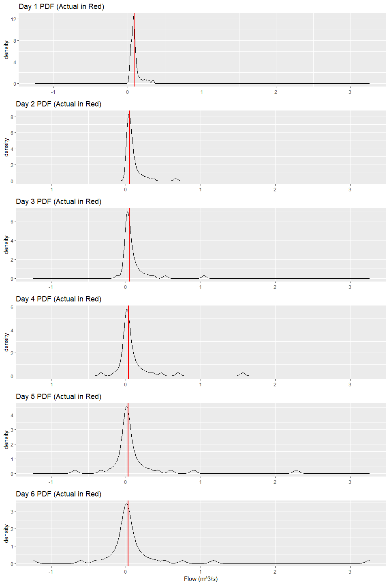

  - [Purpose](#purpose)
  - [Data Cleaning](#data-cleaning)
  - [Functions](#functions)
  - [Modelling](#modelling)
  - [Visualization](#visualization)


## Purpose
The purpose of this notebook is to produce exact probability distributions of flow for `n` time steps into the future using a model with quantile outputs. The “Functions” section (as the name suggests) will define the functions that will be used for the demonstration in the “Modelling” and “Visualization” sections. Explanation of usage is provided for all functions. 

## Data Cleaning

In the cell below, we are loading the dataset, selecting our gauge of
interest, splitting data into training and testing sets.

``` r
# User Specificed Data
gauge <- '05DF008_flow_m3s-1'
train_test_ratio <- 0.83


# Reading data file and selecting desired guage/cleaning
# Make sure that the names of the columns match
river_flow <- read_csv("../data/station_flowrate_R.csv",
                       col_types = cols(.default = "d", time = "D")) %>% 
  select('time', gauge) %>% 
  drop_na() %>% 
  rename('date' = time, 'flow' = gauge) %>% 
  filter(leap_year(date) == FALSE) %>% 
  filter(flow != 0) %>% 
  mutate(Year = year(date), Day = yday(date)) %>%
  select(Year, Day, flow)
```

    ## Note: Using an external vector in selections is ambiguous.
    ## i Use `all_of(gauge)` instead of `gauge` to silence this message.
    ## i See <https://tidyselect.r-lib.org/reference/faq-external-vector.html>.
    ## This message is displayed once per session.

``` r
# Train and test data split
train_data <- river_flow[1:ceiling(length(river_flow$flow)*train_test_ratio), ]
test_data <- river_flow[-(1:ceiling(length(river_flow$flow)*train_test_ratio)), ]
```

## Functions

Below is a function to convert quanitle results to actual sample points.
For example, after fitting a quantile regression model and using the
`predict` method to generate points corresponding to different
quantiles, I use these quantiles in order to generate points that, in a
perfect world, would appear as a “set” to preserve our
respective quantile distribution. For example, given a coin,
we would have one head for every tail, so that the overall
probability is conserved.

We will do this by taking the mean between quantile points. For example,
if the 1st quantile has a flow of 5 and the 2nd quantile has a flow of
10, we will take our point to be 7.5. However, we run into edge cases
here. For instance, there has to be a point lower than the 1st quantile
and higher than the 99th qauntile. To do this, we will assume that the
distance away from the lowest quantile be the same as the distance from
the 1st quantile to its nearest neighbouring sample point. So for the
example above, we will use a flow of 2.5. The same applies to the other
end of the spectrum for the highest sample point.

The above is done to help preserve the distribution of the quantile
regression.

``` r
#' @param quantiles series the quantile outputs after using predict on a `rq` model
#'
#' @return list of all the points presenting that quantile distribution
quantiles_to_points <- function(quantiles) {
  
  # Creating a empty vector to store all the points that will represent the quantile distribution
  my_points <- vector('double', length(quantiles))
  
  for (n in 1:(length(quantiles) + 1)) {
    
    if (n == 1) {
      # This deals with the first quantile point
      quantile_flow <- quantiles[1] - 0.5*(quantiles[2] - quantiles[1])
      my_points[n] <- quantile_flow
      
    } else if (n == (length(quantiles) + 1)) {
      # This deals with the last quantile point
      quantile_flow <- quantiles[n-1] + 0.5*(quantiles[n-1] - quantiles[n-2])
      my_points[n] <- quantile_flow
      
    } else {
      # Quantiles in the middle
      quantile_flow <- (quantiles[n] + quantiles[n-1])/2
      my_points[n] <- quantile_flow
      
    }
  }
  return(my_points)
}
```

When simulating for distributions multiple days ahead, we run into the
issue of exploding computation power needed to full characterize the
distribution. This step acts as a buffer to cap the amount of extra
computation power needed when simulating a large number of days ahead.

For example, say we are simulating for the first day after our train
data, and our quantile regressor estimates 99 quantiles (100 data
points). Now, for the first day of the test set, our input is fixed, the
lag1, lag2 … are fixed values as we know them. However, for our
prediction day, our quantile regressor provides us with 100 points of
equal probabilty. Ok, so what’s is the big deal? There will only be 100
different input data “sets” when predicting day 2 right? While that may
be true, we qucikly realize that each one of the 100 input sets produces
100 sample points itself, yielding us a total of 100^2 data points of
equal probability for day 2. If we continue like this without doing
something about it, the computation time for each day forward will only
grow exponentially.

As a result, I have created a function that shrinks the number of
recorded points each day to be a fixed resolution. For example, for the
100^2 data points created when predicting day 2, I will bin the points
into 100 bins and then take the mean of each of the bins to be the final
values used for that day.

Feel free the change the resolution as desired.

``` r
#' @param temp_data list of all data points generated from the different input data sets used
#' @param resolution int how many data points are generated from a single input. For example, if our model generates quantiels 1:99/100, then the resolution would be 100, as it is the number of points that can be generated to represent the 99 quantiles.
#'
#' @return list a condensed list of all of the data points we have generated
condense_points <- function(temp_data, resolution) {
  # Seeing how big each of the bins should be
  bin_size <- length(temp_data)/resolution
  my_sorted <- sort(temp_data)
  condensed_list <- vector('double', resolution)
  
  for (n in 1:resolution) {
    # taking the mean of each of the bins
    condensed_list[n] <- mean(my_sorted[((n - 1)*bin_size + 1):(n*bin_size)])
  }
  
  return(condensed_list)
}
```

The last problem that we encounter is meshing together points from
different days. Again, we go back to our example. When predicting the
first day of our test data, all of the input data are known, and
therefore we only derive one distribution of 100 points. When predicting
day 2, each one of the data points for day 1 will represent its own
unique input data set, thus creating 100 unique input sets. Likewise,
for day 2 we derive 100 points (using the function above). However, we
realize that, for day 3, we now have 100^2 unique input sets. The number
of input data points will grow exponentially up until the maximum lag
that we are interested in (e.g. we will have a maximum of 100^3 points
when using 3 lags).

In short, the heaviest part of the computation needed will be
proportional to
.

To ensure that possible combinations are covered, the following function
generates a DataFrame that covers all possibilities.

``` r
#' @param current_day int the number of days that we have already simulated
#' @param resolution int how many data points are generated from a single input. For example, if our model generates quantiels 1:99/100, then the resolution would be 100, as it is the number of points that can be generated to represent the 99 quantiles.
#' @param max_lags int the maximum number of autoregressive lags that our model looks at
#' @param input_data data.frame Data Frame of unique input sets we currently have
#' @param sample_storage data.frame Data Frame containing the unique sample points for each individual day
#'
#' @return list a condensed list of all of the data points we have generated
create_input_data <- function(current_day, resolution, max_lags, input_data, sample_storage) {
  
  # Seeing how many rows are required to store all possible combinations
  if (current_day <= max_lags) {
    num_rows <- resolution**current_day
  } else {
    num_rows <- resolution**max_lags
  }
  
  # Creating empty DataFrame to store input sets
  data_storage <- data.frame(matrix(ncol=max_lags, nrow=num_rows))
  
  if (current_day < max_lags) {
    # Copying data over that remains the same
    data_storage[, (current_day + 1):max_lags] <- input_data[, current_day:(max_lags - 1)]
    # Data that needs to be permutated
    data_storage[, 1:current_day] <- expand.grid(sample_storage[, current_day:1])
  } else {
    data_storage[, 1:max_lags] <- expand.grid(sample_storage[, current_day:(current_day-max_lags+1)])
  }
  
  colnames(data_storage) <- c('lag1', 'lag2', 'lag3')
  
  return(data_storage)
}
```

## Modelling

Here we create the quantile regression model that will be used for
predicting future data.

``` r
# User specified info for loess function
my_span <- 0.1
my_tau <- seq(from = 2, to =98 , by = 2)/100


# Training initial model
qr_data <- data.frame('flow' = train_data$flow,
                      'lag1' = lag(train_data$flow, n = 1),
                      'lag2' = lag(train_data$flow, n = 2),
                      'lag3' = lag(train_data$flow, n = 3))

my_model <- rq(flow ~ lag1 + lag2 + lag3, tau = my_tau, data = qr_data)
```

Here we will predict the distributions of flows for any number of given
days ahead. Note that the computational difficulty increases
exponentially as the number of days we are trying to predict approaches
the maximum number of lags of the model. After that, since the input
data set has already reached maximum size, computation time will scale
linearly with the number of days.

``` r
# User specified info for prediction
current_day <- 0
days_forward <- 6
input_data <- data.frame()
sample_storage <- data.frame(matrix(ncol=days_forward, nrow=(length(my_tau) + 1)))
colnames(sample_storage) <- c(1:days_forward)
resolution <- length(my_tau) + 1


# Prediction
while (days_forward > 0) {
  # This is only triggered on the first iteration, as input_data is not yet initialized
  if (length(input_data) == 0) {
    
    # Taking the last day of the train set as continuation
    input_sample <- data.frame('lag1' = tail(qr_data$flow, n = 1),
                               'lag2' = tail(qr_data$lag1, n = 1),
                               'lag3' = tail(qr_data$lag2, n = 1))
    
    # Quantile prediction
    quantile_predictions <- predict(my_model, newdata = input_sample)
    # Conversion to points
    my_points <- quantiles_to_points(quantile_predictions)
    # Updating day
    current_day <- current_day + 1
    # Adding the final sample points
    sample_storage[, current_day] <- my_points
    # Updating remaining number of days needed to predict
    days_forward <- days_forward - 1
    # Creating the input data sets
    input_data <- create_input_data(current_day = current_day,
                                    resolution = resolution,
                                    max_lags = 3,
                                    input_data = input_sample,
                                    sample_storage = sample_storage)
    # How many times we need to iterate
    n_iter <- nrow(input_data)
    # Temporary storage for the all the sample points generated from the new input sets
    temp_data <- vector('double', resolution*nrow(input_data))
  
  # This is triggered as we iterate through the input sets
  } else if (n_iter > 0) {
    
    input_sample <- input_data[n_iter, ]
    
    #attempt(predict(my_model, newdata = input_sample), msg = n_iter)
    quantile_predictions <- predict(my_model, newdata = input_sample)
    
    my_points <- quantiles_to_points(quantile_predictions)
    # Adding the points to temporary storage
    temp_data[((n_iter-1)*length(my_points) + 1):(n_iter*length(my_points))] <- my_points
    n_iter <- n_iter - 1
  
  # This is triggered when we are finished all iterations for a given day  
  } else if (n_iter == 0) {
    
    current_day <- current_day + 1
    # Adding the final sample points after condensing
    sample_storage[, current_day] <- condense_points(temp_data = temp_data,
                                                     resolution = resolution)
    days_forward <- days_forward - 1
    
    if (days_forward > 0) {
      
      
      input_data <- create_input_data(current_day = current_day,
                                      resolution = resolution,
                                      max_lags = 3,
                                      input_data = input_data,
                                      sample_storage = sample_storage)
      
      n_iter <- nrow(input_data)
      print(paste('The number of test set iterations for step', current_day, 'is', n_iter, sep = ' '))
      temp_data <- vector('double', resolution*nrow(input_data))
    }
  }
}
```

    ## [1] "The number of test set iterations for step 2 is 2500"
    ## [1] "The number of test set iterations for step 3 is 125000"
    ## [1] "The number of test set iterations for step 4 is 125000"
    ## [1] "The number of test set iterations for step 5 is 125000"

Cleaning results for presentation

``` r
final_storage <- data.frame(sample_storage)

for (n in 1:ncol(final_storage)) {
  colnames(final_storage)[n] <- paste('Day', n, sep = ' ')
}

final_storage
```

    ##         Day 1      Day 2         Day 3         Day 4        Day 5         Day 6
    ## 1  0.03149744 0.01032882 -0.1179283676 -0.3313174806 -0.681976413 -1.2435744286
    ## 2  0.03296806 0.01181388 -0.0459547726 -0.1535791373 -0.332733404 -0.6021247515
    ## 3  0.03393013 0.01295838 -0.0252467720 -0.1041042561 -0.222165467 -0.4002567768
    ## 4  0.03427803 0.01386778 -0.0145644465 -0.0736749917 -0.163056696 -0.3004137162
    ## 5  0.03458586 0.01492755 -0.0083992418 -0.0562627774 -0.129635197 -0.2331416017
    ## 6  0.03644545 0.01602345 -0.0041991747 -0.0442583710 -0.102900310 -0.1858414467
    ## 7  0.03892242 0.01800803 -0.0009609507 -0.0341193473 -0.083147377 -0.1522487351
    ## 8  0.04005789 0.02022273  0.0017009655 -0.0262094154 -0.068468459 -0.1271197809
    ## 9  0.04158654 0.02232212  0.0038602398 -0.0202071997 -0.056763767 -0.1060347386
    ## 10 0.04366060 0.02435690  0.0058077693 -0.0152190334 -0.046687928 -0.0890291449
    ## 11 0.04575460 0.02621845  0.0076471275 -0.0110125002 -0.038312545 -0.0745746697
    ## 12 0.05168700 0.02812293  0.0093704652 -0.0074560581 -0.031142362 -0.0625731358
    ## 13 0.05862656 0.02994142  0.0111064631 -0.0043637827 -0.025042118 -0.0522454710
    ## 14 0.06278589 0.03195478  0.0129158280 -0.0016621946 -0.019744637 -0.0432786643
    ## 15 0.06588750 0.03400763  0.0148491298  0.0007494887 -0.015085381 -0.0354005738
    ## 16 0.06815378 0.03643053  0.0169069919  0.0029823148 -0.010960652 -0.0285027484
    ## 17 0.06932905 0.03912536  0.0190180718  0.0051165149 -0.007277957 -0.0223928698
    ## 18 0.06951188 0.04183445  0.0211645964  0.0072278371 -0.003971196 -0.0169544453
    ## 19 0.06982495 0.04468240  0.0233202345  0.0093628879 -0.000963406 -0.0120570954
    ## 20 0.07048178 0.04696924  0.0255556521  0.0115541181  0.001839355 -0.0076177286
    ## 21 0.07142284 0.04913815  0.0278364625  0.0138256512  0.004536078 -0.0035722801
    ## 22 0.07297427 0.05141822  0.0301952978  0.0161951599  0.007216957  0.0001733628
    ## 23 0.07489893 0.05347809  0.0327021082  0.0187001727  0.009958913  0.0037607305
    ## 24 0.07609649 0.05557749  0.0353315226  0.0213451152  0.012814123  0.0073229022
    ## 25 0.07660807 0.05773566  0.0380955532  0.0241505831  0.015831104  0.0109771540
    ## 26 0.07690539 0.05987544  0.0410027534  0.0271489659  0.019054285  0.0148195969
    ## 27 0.07769988 0.06216403  0.0440722521  0.0303733354  0.022498043  0.0189230811
    ## 28 0.07948529 0.06457546  0.0472891773  0.0338462952  0.026238941  0.0233081506
    ## 29 0.08195764 0.06720592  0.0507452607  0.0375951947  0.030294798  0.0280999087
    ## 30 0.08398406 0.06977915  0.0544006697  0.0416708621  0.034723211  0.0333238618
    ## 31 0.08521598 0.07272852  0.0583113616  0.0461205336  0.039602478  0.0390432548
    ## 32 0.08679461 0.07560569  0.0625671943  0.0510019198  0.044938753  0.0453509001
    ## 33 0.08895775 0.07913961  0.0672140645  0.0563864959  0.050870975  0.0523365761
    ## 34 0.09070038 0.08311204  0.0722730871  0.0623439031  0.057545394  0.0601334217
    ## 35 0.09180523 0.08723755  0.0779791561  0.0690264452  0.065025611  0.0689601277
    ## 36 0.09351554 0.09167218  0.0842439178  0.0765693574  0.073486329  0.0790427544
    ## 37 0.09614248 0.09696584  0.0914007809  0.0850920230  0.083194533  0.0905195458
    ## 38 0.09928157 0.10289230  0.0995627235  0.0948062111  0.094376243  0.1037372314
    ## 39 0.10485807 0.11062233  0.1087444297  0.1060382119  0.107383520  0.1189821743
    ## 40 0.10972614 0.11837455  0.1197057485  0.1191441527  0.122732230  0.1370297266
    ## 41 0.11444363 0.12913515  0.1323150187  0.1344268537  0.141244286  0.1587712393
    ## 42 0.12046305 0.14037228  0.1476372187  0.1528756999  0.163180981  0.1852721817
    ## 43 0.12782084 0.15578969  0.1657213725  0.1756145584  0.191293015  0.2194574723
    ## 44 0.14431152 0.17414846  0.1888256415  0.2051362827  0.226018721  0.2621755436
    ## 45 0.16034581 0.19752741  0.2178480647  0.2408255056  0.273503488  0.3209660865
    ## 46 0.18785457 0.22359807  0.2553438559  0.2896180131  0.335554311  0.4006088807
    ## 47 0.22132329 0.25562843  0.3003794035  0.3618375408  0.431769112  0.5235085547
    ## 48 0.24559271 0.29745869  0.3684668593  0.4733942993  0.600694229  0.7554252483
    ## 49 0.28551295 0.36605031  0.5297893258  0.7002844389  0.905531122  1.1715588110
    ## 50 0.33793269 0.66976948  1.0473321941  1.5664097445  2.281119284  3.2540438135

Here are the actual flows, with the first row corresponding to `Day 1`
…etc.

``` r
head(test_data)
```

    ## # A tibble: 6 x 3
    ##    Year   Day   flow
    ##   <dbl> <dbl>  <dbl>
    ## 1  2014   160 0.0850
    ## 2  2014   161 0.055 
    ## 3  2014   162 0.0470
    ## 4  2014   163 0.037 
    ## 5  2014   164 0.0300
    ## 6  2014   165 0.0260

# Visualization

Here we will plot the density for each day to obtain the probability
distribution for each day. I have not automated the plotting aspect.

``` r
plot1 <- ggplot(data = final_storage) +
  geom_density(aes(`Day 1`)) +
  geom_vline(xintercept = test_data$flow[1], color = 'red', size = 1) +
  ggtitle('Day 1 PDF (Actual in Red)') +
  xlim(min(final_storage), max(final_storage)) +
  theme(axis.title.x = element_blank())

plot2 <- ggplot(data = final_storage) +
  geom_density(aes(`Day 2`)) +
  geom_vline(xintercept = test_data$flow[2], color = 'red', size = 1) +
  ggtitle('Day 2 PDF (Actual in Red)') +
  xlim(min(final_storage), max(final_storage)) +
  theme(axis.title.x = element_blank())

plot3 <- ggplot(data = final_storage) +
  geom_density(aes(`Day 3`)) +
  geom_vline(xintercept = test_data$flow[3], color = 'red', size = 1) +
  ggtitle('Day 3 PDF (Actual in Red)') +
  xlim(min(final_storage), max(final_storage)) +
  theme(axis.title.x = element_blank())

plot4 <- ggplot(data = final_storage) +
  geom_density(aes(`Day 4`)) +
  geom_vline(xintercept = test_data$flow[4], color = 'red', size = 1) +
  ggtitle('Day 4 PDF (Actual in Red)') +
  xlim(min(final_storage), max(final_storage)) +
  theme(axis.title.x = element_blank())

plot5 <- ggplot(data = final_storage) +
  geom_density(aes(`Day 5`)) +
  geom_vline(xintercept = test_data$flow[5], color = 'red', size = 1) +
  ggtitle('Day 5 PDF (Actual in Red)') +
  xlim(min(final_storage), max(final_storage)) +
  theme(axis.title.x = element_blank())

plot6 <- ggplot(data = final_storage) +
  geom_density(aes(`Day 6`)) +
  geom_vline(xintercept = test_data$flow[6], color = 'red', size = 1) +
  ggtitle('Day 6 PDF (Actual in Red)') +
  xlim(min(final_storage), max(final_storage)) +
  xlab('Flow (m^3/s)')

ggarrange(plot1, plot2, plot3, plot4, plot5, plot6, ncol = 1)
```

<!-- -->
