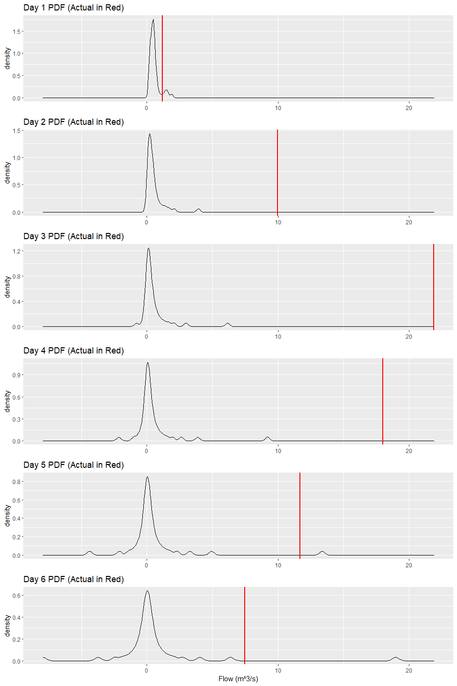

  - [Purpose](#purpose)
  - [Data Cleaning](#data-cleaning)
  - [Modelling](#modelling)
  - [Visualization](#visualization)


## Purpose
Similar to the `deterministic_flows` notebook, we produce the exact 
probability distributions of flow n time steps into the future. However 
this time, when splitting the train/test set, we pick a day a few steps 
prior to a flooding event. This is to demonstrate that the model is 
unable to accurately predict events outside of a one time-step range. 
As the functions used are the same, we just import them to reduce volume. 

## Data Cleaning

In the cell below, we are loading the dataset, selecting our gauge of
interest, splitting data into training and testing sets.

``` r
# User Specificed Data
gauge <- '05DF008_flow_m3s-1'
train_test_ratio <- 0.799


# Reading data file and selecting desired guage/cleaning
# Make sure that the names of the columns match
river_flow <- read_csv("../data/station_flowrate_R.csv",
                       col_types = cols(.default = "d", time = "D")) %>% 
  select('time', gauge) %>% 
  drop_na() %>% 
  rename('date' = time, 'flow' = gauge) %>% 
  filter(leap_year(date) == FALSE) %>% 
  filter(flow != 0) %>% 
  mutate(Year = year(date), Day = yday(date)) %>%
  select(Year, Day, flow)
```

    ## Note: Using an external vector in selections is ambiguous.
    ## i Use `all_of(gauge)` instead of `gauge` to silence this message.
    ## i See <https://tidyselect.r-lib.org/reference/faq-external-vector.html>.
    ## This message is displayed once per session.

``` r
# Train and test data split
train_data <- river_flow[1:ceiling(length(river_flow$flow)*train_test_ratio), ]
test_data <- river_flow[-(1:ceiling(length(river_flow$flow)*train_test_ratio)), ]
```

## Modelling

Here we create the quantile regression model that will be used for
predicting future data.

``` r
# User specified info for loess function
my_span <- 0.1
my_tau <- seq(from = 2, to =98 , by = 2)/100


# Training initial model
qr_data <- data.frame('flow' = train_data$flow,
                      'lag1' = lag(train_data$flow, n = 1),
                      'lag2' = lag(train_data$flow, n = 2),
                      'lag3' = lag(train_data$flow, n = 3))

my_model <- rq(flow ~ lag1 + lag2 + lag3, tau = my_tau, data = qr_data)
```

Here we will predict the distributions of flows for any number of given
days ahead. Note that the computational difficulty increases
exponentially as the number of days we are trying to predict approaches
the maximum number of lags of the model. After that, since the input
data set has already reached maximum size, computation time will scale
linearly with the number of days.

``` r
# User specified info for prediction
current_day <- 0
days_forward <- 6
input_data <- data.frame()
sample_storage <- data.frame(matrix(ncol=days_forward, nrow=(length(my_tau) + 1)))
colnames(sample_storage) <- c(1:days_forward)
resolution <- length(my_tau) + 1


# Prediction
while (days_forward > 0) {
  # This is only triggered on the first iteration, as input_data is not yet initialized
  if (length(input_data) == 0) {
    
    # Taking the last day of the train set as continuation
    input_sample <- data.frame('lag1' = tail(qr_data$flow, n = 1),
                               'lag2' = tail(qr_data$lag1, n = 1),
                               'lag3' = tail(qr_data$lag2, n = 1))
    
    # Quantile prediction
    quantile_predictions <- predict(my_model, newdata = input_sample)
    # Conversion to points
    my_points <- quantiles_to_points(quantile_predictions)
    # Updating day
    current_day <- current_day + 1
    # Adding the final sample points
    sample_storage[, current_day] <- my_points
    # Updating remaining number of days needed to predict
    days_forward <- days_forward - 1
    # Creating the input data sets
    input_data <- create_input_data(current_day = current_day,
                                    resolution = resolution,
                                    max_lags = 3,
                                    input_data = input_sample,
                                    sample_storage = sample_storage)
    # How many times we need to iterate
    n_iter <- nrow(input_data)
    # Temporary storage for the all the sample points generated from the new input sets
    temp_data <- vector('double', resolution*nrow(input_data))
  
  # This is triggered as we iterate through the input sets
  } else if (n_iter > 0) {
    
    input_sample <- input_data[n_iter, ]
    
    #attempt(predict(my_model, newdata = input_sample), msg = n_iter)
    quantile_predictions <- predict(my_model, newdata = input_sample)
    
    my_points <- quantiles_to_points(quantile_predictions)
    # Adding the points to temporary storage
    temp_data[((n_iter-1)*length(my_points) + 1):(n_iter*length(my_points))] <- my_points
    n_iter <- n_iter - 1
  
  # This is triggered when we are finished all iterations for a given day  
  } else if (n_iter == 0) {
    
    current_day <- current_day + 1
    # Adding the final sample points after condensing
    sample_storage[, current_day] <- condense_points(temp_data = temp_data,
                                                     resolution = resolution)
    days_forward <- days_forward - 1
    
    if (days_forward > 0) {
      
      
      input_data <- create_input_data(current_day = current_day,
                                      resolution = resolution,
                                      max_lags = 3,
                                      input_data = input_data,
                                      sample_storage = sample_storage)
      
      n_iter <- nrow(input_data)
      print(paste('The number of test set iterations for step', current_day, 'is', n_iter, sep = ' '))
      temp_data <- vector('double', resolution*nrow(input_data))
    }
  }
}
```

    ## [1] "The number of test set iterations for step 2 is 2500"
    ## [1] "The number of test set iterations for step 3 is 125000"
    ## [1] "The number of test set iterations for step 4 is 125000"
    ## [1] "The number of test set iterations for step 5 is 125000"

Cleaning results for presentation

``` r
final_storage <- data.frame(sample_storage)

for (n in 1:ncol(final_storage)) {
  colnames(final_storage)[n] <- paste('Day', n, sep = ' ')
}

final_storage
```

    ##        Day 1      Day 2        Day 3        Day 4       Day 5        Day 6
    ## 1  0.2114475 0.06717896 -0.777224221 -2.141864260 -4.36888995 -7.918999828
    ## 2  0.2128825 0.07147090 -0.322224352 -0.998860056 -2.10274348 -3.725757951
    ## 3  0.2139662 0.07483670 -0.191089741 -0.675173353 -1.38566372 -2.452511732
    ## 4  0.2144136 0.07656121 -0.117810202 -0.484723494 -1.02845527 -1.839637683
    ## 5  0.2146968 0.07870390 -0.076743928 -0.377485925 -0.81723909 -1.415816295
    ## 6  0.2149561 0.08238408 -0.049837853 -0.302266761 -0.65038431 -1.127829169
    ## 7  0.2251910 0.08777234 -0.029351723 -0.238344925 -0.52893382 -0.928007258
    ## 8  0.2396134 0.09676539 -0.011511072 -0.188479789 -0.43927758 -0.775267409
    ## 9  0.2453140 0.10696291  0.004588792 -0.149827777 -0.36826515 -0.647839140
    ## 10 0.2524355 0.11702255  0.016679378 -0.118799920 -0.30608880 -0.547126334
    ## 11 0.2597619 0.12916102  0.026816738 -0.092280024 -0.25507829 -0.460681407
    ## 12 0.2674838 0.14427281  0.036844911 -0.069942755 -0.21121956 -0.389477676
    ## 13 0.2893471 0.15736312  0.044958706 -0.050451926 -0.17438241 -0.327992587
    ## 14 0.3246816 0.16880478  0.053508575 -0.033545057 -0.14235988 -0.274804384
    ## 15 0.3675963 0.17737430  0.062084689 -0.018658091 -0.11432978 -0.228706005
    ## 16 0.3957852 0.18975495  0.072063366 -0.005262807 -0.08944553 -0.188391564
    ## 17 0.4103573 0.20093493  0.082703075  0.006951463 -0.06734249 -0.152786644
    ## 18 0.4218825 0.21352689  0.094305716  0.018408490 -0.04757897 -0.121125556
    ## 19 0.4237035 0.22774462  0.106467849  0.029462374 -0.02981838 -0.092887298
    ## 20 0.4327995 0.24495113  0.119093196  0.040635540 -0.01362390 -0.067419512
    ## 21 0.4453112 0.26132463  0.131866854  0.052187989  0.00137886 -0.044341101
    ## 22 0.4539813 0.27573891  0.145057586  0.064249226  0.01563749 -0.023275163
    ## 23 0.4608695 0.29039159  0.158345831  0.076910426  0.02972092 -0.003723711
    ## 24 0.4626724 0.30520979  0.172426426  0.090394302  0.04414723  0.014982921
    ## 25 0.4629081 0.31858905  0.187435441  0.104796188  0.05926478  0.033611450
    ## 26 0.4642575 0.33264305  0.203404847  0.120295549  0.07531742  0.052908620
    ## 27 0.4703533 0.34580720  0.220418522  0.137009877  0.09260144  0.073283794
    ## 28 0.4835426 0.36207433  0.238633635  0.155003036  0.11129585  0.095370085
    ## 29 0.4989822 0.37775047  0.257879976  0.174540672  0.13166100  0.119346998
    ## 30 0.5098314 0.39223901  0.278568849  0.195896770  0.15410370  0.145416775
    ## 31 0.5161260 0.40932214  0.301165670  0.219249417  0.17869789  0.174356453
    ## 32 0.5261005 0.42841428  0.325306740  0.245000963  0.20596247  0.206353887
    ## 33 0.5389974 0.44845546  0.351882179  0.273621452  0.23667315  0.241782463
    ## 34 0.5476498 0.47154914  0.381081735  0.305346421  0.27108078  0.281685864
    ## 35 0.5561710 0.49369103  0.413112199  0.341116314  0.30970796  0.326749027
    ## 36 0.5695516 0.52031842  0.449219141  0.381605576  0.35340702  0.378131409
    ## 37 0.5839334 0.55370700  0.488623366  0.427691241  0.40351105  0.437274641
    ## 38 0.6028719 0.58355273  0.533841564  0.480661822  0.46181311  0.505961251
    ## 39 0.6357618 0.62141666  0.584543319  0.541446950  0.53040049  0.586916689
    ## 40 0.6648893 0.66583679  0.642852418  0.611995588  0.61207565  0.682175390
    ## 41 0.6832873 0.72037672  0.712158593  0.696002274  0.70769417  0.794750490
    ## 42 0.7174909 0.79022989  0.797848363  0.797217778  0.82621683  0.936569293
    ## 43 0.7447197 0.87894455  0.897153164  0.916996678  0.97767622  1.113140671
    ## 44 0.8034881 0.99566149  1.030300655  1.081636907  1.16420258  1.345648959
    ## 45 0.9688175 1.13903051  1.201552400  1.286740448  1.42639513  1.654491891
    ## 46 1.2337412 1.30377945  1.424847987  1.564391939  1.76661184  2.090315296
    ## 47 1.4265177 1.47160574  1.690980895  1.974649062  2.30026906  2.750984317
    ## 48 1.4713935 1.71338793  2.070124950  2.626389425  3.27957249  4.049018524
    ## 49 1.6188132 2.08109803  2.983893096  3.870358132  4.94215332  6.391392554
    ## 50 1.8979484 3.92866543  6.155938604  9.213003173 13.38527785 19.008242684

Here are the actual flows, with the first row corresponding to `Day 1`
…etc.

``` r
head(test_data)
```

    ## # A tibble: 6 x 3
    ##    Year   Day  flow
    ##   <dbl> <dbl> <dbl>
    ## 1  2014    97  1.20
    ## 2  2014    98  9.98
    ## 3  2014    99 21.9 
    ## 4  2014   100 18   
    ## 5  2014   101 11.7 
    ## 6  2014   102  7.48

# Visualization

Here we will plot the density for each day to obtain the probability
distribution for each day. I have not automated the plotting aspect.

``` r
plot1 <- ggplot(data = final_storage) +
  geom_density(aes(`Day 1`)) +
  geom_vline(xintercept = test_data$flow[1], color = 'red', size = 1) +
  ggtitle('Day 1 PDF (Actual in Red)') +
  xlim(min(final_storage), test_data$flow[3]) +
  theme(axis.title.x = element_blank())

plot2 <- ggplot(data = final_storage) +
  geom_density(aes(`Day 2`)) +
  geom_vline(xintercept = test_data$flow[2], color = 'red', size = 1) +
  ggtitle('Day 2 PDF (Actual in Red)') +
  xlim(min(final_storage), test_data$flow[3]) +
  theme(axis.title.x = element_blank())

plot3 <- ggplot(data = final_storage) +
  geom_density(aes(`Day 3`)) +
  geom_vline(xintercept = test_data$flow[3], color = 'red', size = 1) +
  ggtitle('Day 3 PDF (Actual in Red)') +
  xlim(min(final_storage), test_data$flow[3]) +
  theme(axis.title.x = element_blank())

plot4 <- ggplot(data = final_storage) +
  geom_density(aes(`Day 4`)) +
  geom_vline(xintercept = test_data$flow[4], color = 'red', size = 1) +
  ggtitle('Day 4 PDF (Actual in Red)') +
  xlim(min(final_storage), test_data$flow[3]) +
  theme(axis.title.x = element_blank())

plot5 <- ggplot(data = final_storage) +
  geom_density(aes(`Day 5`)) +
  geom_vline(xintercept = test_data$flow[5], color = 'red', size = 1) +
  ggtitle('Day 5 PDF (Actual in Red)') +
  xlim(min(final_storage), test_data$flow[3]) +
  theme(axis.title.x = element_blank())

plot6 <- ggplot(data = final_storage) +
  geom_density(aes(`Day 6`)) +
  geom_vline(xintercept = test_data$flow[6], color = 'red', size = 1) +
  ggtitle('Day 6 PDF (Actual in Red)') +
  xlim(min(final_storage), test_data$flow[3]) +
  xlab('Flow (m^3/s)')

ggarrange(plot1, plot2, plot3, plot4, plot5, plot6, ncol = 1)
```

<!-- -->
